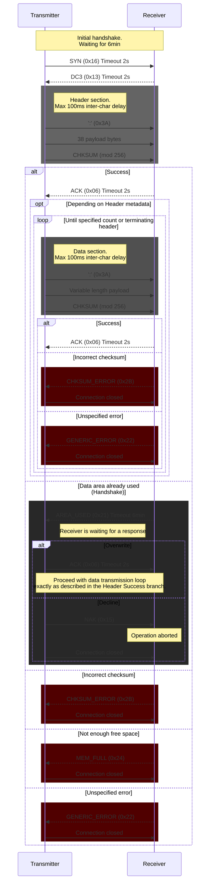

```mermaid
sequenceDiagram
    participant T as Transmitter
    participant R as Receiver

    Note over T,R: Initial handshake.<br/>Waiting for 6min
    T->>R: SYN (0x16) Timeout 2s
    R-->>T: DC3 (0x13) Timeout 2s
    
    rect rgb(100, 100, 100)
    Note right of T: Header section.<br/>Max 100ms inter-char delay
    T->>R: ':' (0x3A)
    T->>R: 38 payload bytes
    T->>R: CHKSUM (mod 256)
    end

    alt Success
        R-->>T: ACK (0x06) Timeout 2s

        opt Depending on Header metadata
            loop Until specified count or terminating header
                rect rgb(80, 80, 80)
                Note right of T: Data section.<br/>Max 100ms inter-char delay
                T->>R: ':' (0x3A)
                T->>R: Variable length payload
                T->>R: CHKSUM (mod 256)
                end
                alt Success
                    R-->>T: ACK (0x06) Timeout 2s
                else Incorrect checksum
                    rect rgb(80, 0, 0)
                    R-->>T: CHKSUM_ERROR (0x2B)
                    T-xR: Connection closed
                    end
                else Unspecified error
                    rect rgb(80, 0, 0)
                    R-->>T: GENERIC_ERROR (0x22)
                    T-xR: Connection closed
                    end
                end
            end
        end

    else Data area already used<br/>(Handshake)
        rect rgb(40, 40, 40)
        R-->>T: AREA_USED (0x21) Timeout 6min
        Note left of R: Receiver is waiting for a response
        alt Overwrite
            T->>R: ACK (0x06) Timeout 2s
            Note over T,R: Proceed with data transmission loop<br/>exactly as described in the Header Success branch.
        else Decline
            T->>R: NAK (0x15)
            Note over R: Operation aborted
            T-xR: Connection closed
        end
        end
    else Incorrect checksum
        rect rgb(80, 0, 0)
        R-->>T: CHKSUM_ERROR (0x2B)
        T-xR: Connection closed
        end
    else Not enough free space
        rect rgb(80, 0, 0)
        R-->>T: MEM_FULL (0x24)
        T-xR: Connection closed
        end
    else Unspecified error
        rect rgb(80, 0, 0)
        R-->>T: GENERIC_ERROR (0x22)
        T-xR: Connection closed
        end
    end
```
