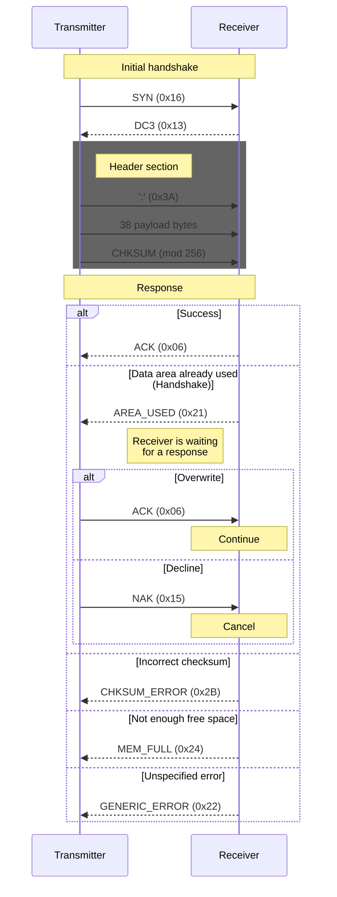

```mermaid
sequenceDiagram
    participant T as Transmitter
    participant R as Receiver

    Note over T,R: Initial handshake
    T->>R: SYN (0x16)
    R-->>T: DC3 (0x13)
    
    rect rgb(100, 100, 100)
    Note right of T: Header section
    T->>R: ':' (0x3A)
    T->>R: 38 payload bytes
    T->>R: CHKSUM (mod 256)
    end

    Note over T,R: Response
    alt Success
        R-->>T: ACK (0x06)
    else Data area already used<br/>(Handshake)
        R-->>T: AREA_USED (0x21)
        Note left of R: Receiver is waiting<br/>for a response
        
        alt Overwrite
            T->>R: ACK (0x06)
            Note over R: Continue
        else Decline
            T->>R: NAK (0x15)
            Note over R: Cancel
        end
    else Incorrect checksum
        R-->>T: CHKSUM_ERROR (0x2B)
    else Not enough free space
        R-->>T: MEM_FULL (0x24)
    else Unspecified error
        R-->>T: GENERIC_ERROR (0x22)
    end
```
